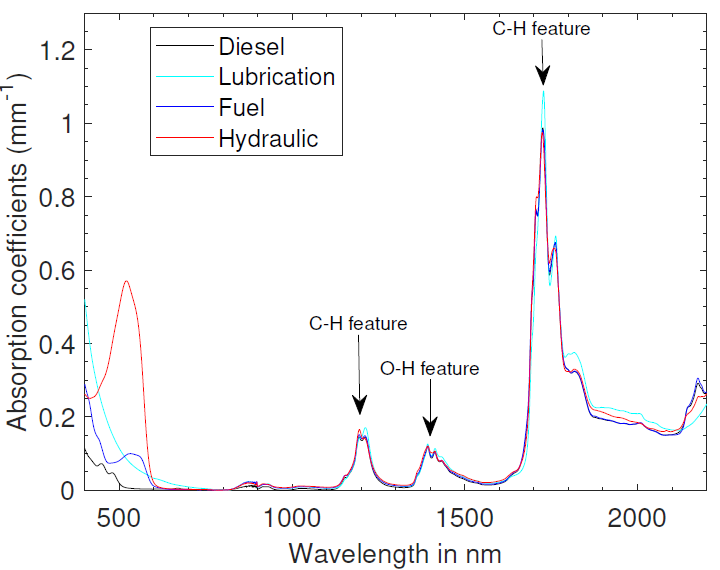
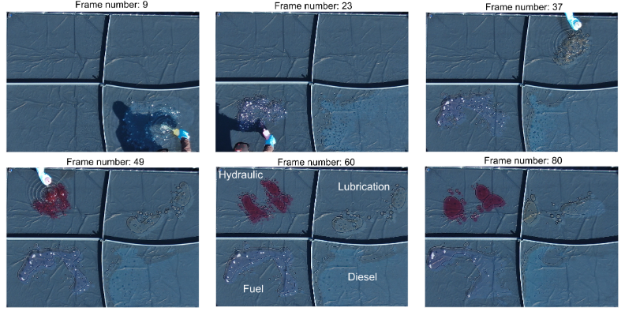

# Oil_spill
In this work, we studied the potential of the visible, near-infrared, and shortwave infrared wavelength regions for monitoring oil spill incidents from optical reflectance. First, a simple physical model was proposed for accurate oil thickness and volume estimation from optical reflectance. The developed method was made invariant to changes in the acquisition and illumination conditions. In the next step, an algorithm based on an artificial neural network was designed to detect spilled oil. The training samples that are required to optimize the parameters of the network were generated by utilizing the proposed physical model. To validate the method, experiments were conducted in laboratory and outdoor scenarios for detection and thickness/volume estimation on four different oil types. 

  

The absorption spectra of these four oils were estimated by measuring the transmission spectra of samples of approximately 2 ml. 

  

To demonstrate the potential of the proposed method, we developed hyperspectral datasets of oil samples with varying thicknesses between 500 μm and 5000 μm acquired by two different sensors, an Agrispec (ASD) spectrometer, and an Imec snapscan shortwave infrared hyperspectral camera, under strictly controlled experimental settings. To demonstrate the potential of the proposed method in outdoor environments using solely the visible wavelength region, we monitored the evolution of artificially spilled oil in an outdoor scene with an RGB camera mounted on a drone.

  

